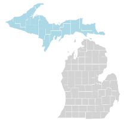
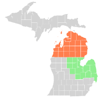
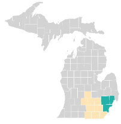
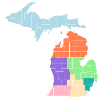

# Pedestrian and Bicyclist Safety Risk Assessment Tool

This is a MDOT Project with Dr. Robert Hampshire and Dr. Lisa Molnar

The webtool is located at http://sicunchen.github.io/pedbikeexposure

## Summary

- 10 Fusion Tables
- 3 Fusion Table Layers (5 Layer Limit)
  - PAZ
  - Road Segment
  - Points of Interest

## List of Fusion Tables

### Bike Ped Risk Exposure

|               MDOT Regions                | Map                                       |                                             Bicycle/Pedestrian                                             |
| :---------------------------------------: | ----------------------------------------- | :--------------------------------------------------------------------------------------------------------: |
|                 Superior                  |     | [fusion table](https://fusiontables.google.com/DataSource?docid=1pp4Axxd5C8U7RByKuZsidxmSulBH7YSDTWn25ohQ) |
|               North Bay                |  | [fusion table](https://fusiontables.google.com/DataSource?docid=12Vn0EY7_LJm_kHKsjUnJO4luY-4cekMha6QCiPoG) |
| Grand Metro University Southwest |             | [fusion table](https://fusiontables.google.com/DataSource?docid=1pL3uVpWWEVwXZLUs-LvfSMFSBwd-KL94bT7qxUm9) |

### Road Segments

|       MDOT Regions       | Map                                                          | Bicycle                                                                                                    | Pedestrian                                                                                                 |
| :----------------------: | ------------------------------------------------------------ | ---------------------------------------------------------------------------------------------------------- | ---------------------------------------------------------------------------------------------------------- |
| Superior North Bay |  | [fusion table](https://fusiontables.google.com/DataSource?docid=1jG6XplSByvnOTrKJsu240CvPj47fi-Buo5CG733v) | [fusion table](https://fusiontables.google.com/DataSource?docid=1xmTwYnMVqWloOCs2r4CaXLSmmSUAORhTbK4oHJN7) |
|    Grand Southwest    |         | [fusion table](https://fusiontables.google.com/DataSource?docid=1uVriSHt8mBMmp2-M90TrXHpWeY0KKTuiogaq3p_4) | [fusion table](https://fusiontables.google.com/DataSource?docid=1M8aJiDnW-DYfP3JGfoWaKS2TtqakFrAGmzyu1az4) |
|   University Metro    |              | [fusion table](https://fusiontables.google.com/DataSource?docid=1KaSmG9GnL0svhfGWIOyg_PMJvBFCKp3bbwZSc1md) | [fusion table](https://fusiontables.google.com/DataSource?docid=1MhIuLV6ryl1C6wcIhYqyLG7JkdSCu38Vq1lGO8w5) |

### Points of Interest (Crashes, Schools, Bars)

| MDOT Region | Map                          | POI                                                                                                        |
| :---------: | ---------------------------- | ---------------------------------------------------------------------------------------------------------- |
|  Michigan   |  | [fusion table](https://fusiontables.google.com/DataSource?docid=1WYNs_bniznkgQMwU-lhxstOJ7vlTvVggXSV4TMUh) |

### NAICS Code

The table belows illustrates the NAICS code that was used to classify schools and bars from our Reference USA dataset.

| NAICS Code | Point Type | Title                                            |
| ---------- | ---------- | ------------------------------------------------ |
| 611110     | Schools    | Elementary and Secondary Schools                 |
| 611310     | Schools    | Colleges, Universities, and Professional Schools |
| 624410     | Schools    | Child Day Care Services                          |
| 722410     | Bars       | Drinking Places (Alcoholic Beverages)            |

## Development

### Install Dependencies

`npm install`

### Start the Dev Server

`npm start`

## Deployment

To create a production bundle:

`npm run build`

Deploy to github page:

`npm run deploy`
