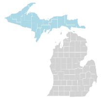
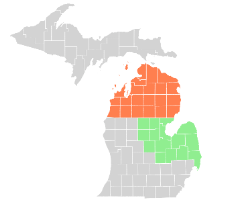
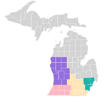
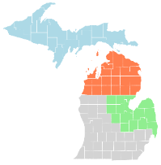
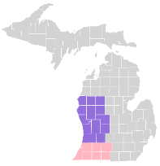
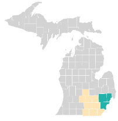
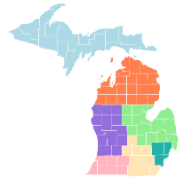

# Pedestrian and Bicyclist Safety Risk Assessment Tool

MDOT Project with Dr. Robert Hampshire and Dr. Lisa Molnar

## Summary
- 10 Fusion Tables
- 3 Fusion Table Layers (5 Layer Limit)
- 3 Filters (County, Ranking, Points of Interests)

## List of Fusion Tables
### Bike Ped Risk Exposure (by MDOT Regions)
Region|Map
---|---
[Superior](https://fusiontables.google.com/DataSource?docid=1pp4Axxd5C8U7RByKuZsidxmSulBH7YSDTWn25ohQ#rows:id=1)|
[North, Bay](https://fusiontables.google.com/DataSource?docid=12Vn0EY7_LJm_kHKsjUnJO4luY-4cekMha6QCiPoG#rows:id=1)|
[Grand, Metro, University, Southwest](https://fusiontables.google.com/DataSource?docid=1pL3uVpWWEVwXZLUs-LvfSMFSBwd-KL94bT7qxUm9#rows:id=1)|
		
### Road Segments (by MDOT Regions)
MDOT Regions|Bicycle|Pedestrian|Map
---|---|---|---
Superior, North, Bay|[link](https://fusiontables.google.com/DataSource?docid=1jG6XplSByvnOTrKJsu240CvPj47fi-Buo5CG733v#rows:id=1)|[link](https://fusiontables.google.com/DataSource?docid=1xmTwYnMVqWloOCs2r4CaXLSmmSUAORhTbK4oHJN7#rows:id=1)|
Grand, Southwest|[link](https://fusiontables.google.com/DataSource?docid=1uVriSHt8mBMmp2-M90TrXHpWeY0KKTuiogaq3p_4#rows:id=1)|[link](https://fusiontables.google.com/DataSource?docid=1M8aJiDnW-DYfP3JGfoWaKS2TtqakFrAGmzyu1az4#rows:id=1)|
University, Metro|[link](https://fusiontables.google.com/DataSource?docid=1KaSmG9GnL0svhfGWIOyg_PMJvBFCKp3bbwZSc1md#rows:id=1)|[link](https://fusiontables.google.com/DataSource?docid=1MhIuLV6ryl1C6wcIhYqyLG7JkdSCu38Vq1lGO8w5#rows:id=1)|

### Points of Interest (Crashes, Schools, Bars)
- [Michigan](https://fusiontables.google.com/DataSource?docid=1WYNs_bniznkgQMwU-lhxstOJ7vlTvVggXSV4TMUh#rows:id=1)  

NAICS Code|Point Type|Title
---|---|---
611110|Schools|Elementary and Secondary Schools
611310|Schools|Colleges, Universities, and Professional Schools
624410|Schools|Child Day Care Services
722410|Bars|Drinking Places (Alcoholic Beverages)
